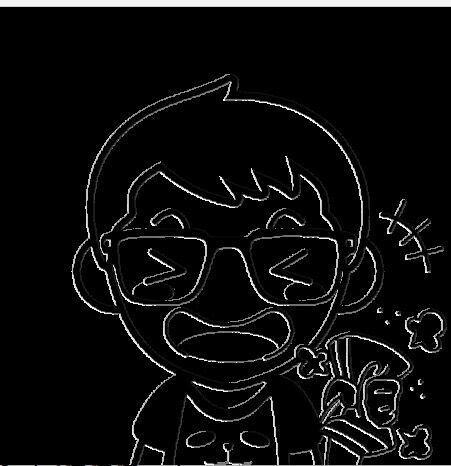
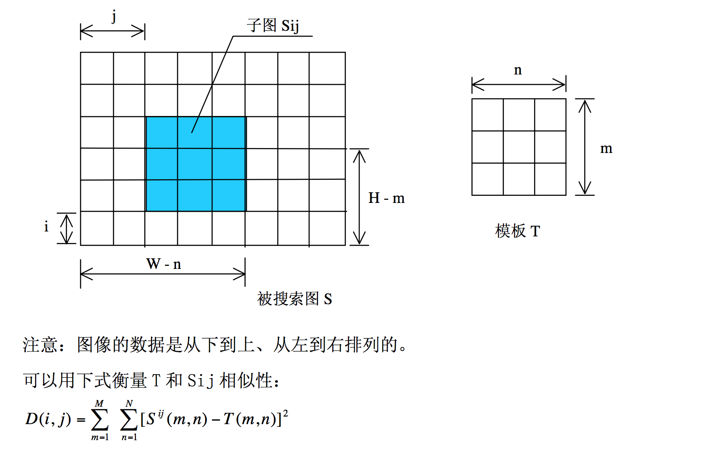

##处理原始图片

##灰度化
在RGB模型中，如果R=G=B时，则彩色表示一种灰度颜色，其中R=G=B的值叫灰度值。
因此，灰度图像每个像素只需一个字节存放灰度值（又称强度值、亮度值），灰度范围为0-255[2]。这样就得到一幅图片的灰度图。

###算法 (Java实现)
加权法：由于人眼颜色敏感度不同，按下一定的权值对RGB三分量进行加权平均能得到较合理的灰度图像。(Y = 0.30R + 0.59G + 0.11B)

### 处理效果

##亮度与对比度处理

图像亮度本质上图像中每个像素的亮度，每个像素的亮度本质上RGB值的大小，RGB值为0是像素点为黑色，RGB都为255时像素点最亮，为白色。
对比度则是不同像素点之间的差值，差值越大，对比度越明显。

### 算法 (Java实现)

调整图像亮度与对比度算法主要由以下几个步骤组成：

1. 计算图像的RGB像素均值– M
2. 对图像的每个像素点Remove平均值-M
3. 对去掉平均值以后的像素点 P乘以对比度系数
4. 对步骤上处理以后的像素P加上 M乘以亮度系统
5. 对像素点RGB值完成重新赋值

### 处理效果

##阈值分割

按图像的灰度特性,将图像分成背景和目标2部分。背景和目标之间的类间方差越大,说明构成图像的2部分的差别越大,当部分目标错分为背景或部分背景错分为目标都会导致2部分差别变小。
因此,使类间方差最大的分割意味着错分概率最小。

### 算法 (Java实现)
最大类间方差法：对于图像I(x,y),前景(即目标)和背景的分割阈值记作T,属于前景的像素点数占整幅图像的比例记为ω0,其平均灰度μ0;背景像素点数占整幅图像的比例为ω1,其平均灰度为μ1。图像的总平均
灰度记为μ,类间方差记为g。假设图像的背景较暗,并且图像的大小为M×N,图像中像素的灰度值小于阈值T的像素个数记作N0,像素灰度大于阈值T的像素个数记作N1,则有:

1. ω0=N0/ M×N
2. ω1=N1/ M×N
3. N0+N1=M×N
4. ω0+ω1=1
5. μ=ω0*μ0+ω1*μ1
6. g=ω0(μ0-μ)^2+ω1(μ1-μ)^2

将式(5)代入式(6),得到等价公式:g=ω0ω1(μ0-μ1)^2。采用遍历的方法得到使类间方差最大的阈值T
### 处理效果
计算最佳阈值为105

##提取特征纹理分割
###算法 (Python实现)
LBP：是一种能够有效地度量和提取图像局部纹理信息的算子,具有旋转不变性和灰度不变性等显著的优点.它是人脸识别中一种提取特征的重要方法,具有对光照不敏感的特性,但是对姿态和表情的鲁棒性不强. 

原始的LBP算法的基本思想是在3*3的窗口内,以窗口中心像素为阈值,将相邻的8个像素的灰度值与其进行比较,若周围像素值大于中心像素值,则该像素点的位置被标记为1,否则为0.这样,3*3邻域内的8个点经过比较可产生8位二进制数，即得到该窗口中心像素点的LBP值,并用这个值来反映该区域的纹理信息.

### 处理效果

##模板匹配

模板就是一幅已知的小图像.模板匹配就是在一幅大图像中搜寻目标,已知该图中有要找的目标,且该目标同模板有相同的尺寸方向和图像,通过一定的算法可以在图中找到目标,确定其坐标位置.

###算法 (Python实现)
将搜索模板 T( m×n 个像素)叠放在被搜索图S( W×H 个像素)上平移，模板覆盖被搜索图的那块区域叫子图Sij。i，j为子图在被搜索图S 上的坐标。搜索范围是：1≤ i ≤ W–m 和 1≤ j ≤ H–n。通过比较T 和Sij 的相似性，完成模板匹配过程。衡量模板T和子图Si,j的匹配程度,可将上面第一个式子展开得到下面的：

从展开的公式中可以看出，中间第二项是一个常数，也就是只跟模板有关系，而第一个和第三个是和原图有关的，随着模板在原图上的移动，这两个值也在发生变化。当D(i,j)的值最小时，说明找到了目标。

该方法采用平方差来进行匹配；最好的匹配值为0；匹配越差，匹配值越大。

### 模板图片

### 处理效果
计算值为 100 170

